# Genome Science 2019

We are very proud to thank our awesome sponsors who make this meeting possible

### Dinner
.converted.png)

### Gold

|   |   |
| ------------- |---------------| 
| 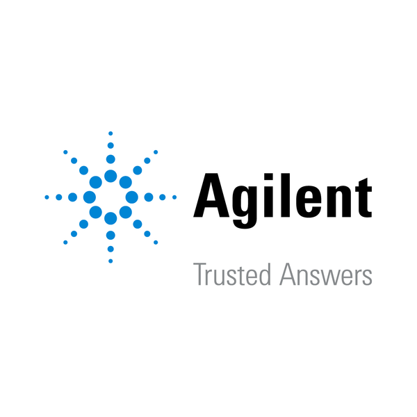 | 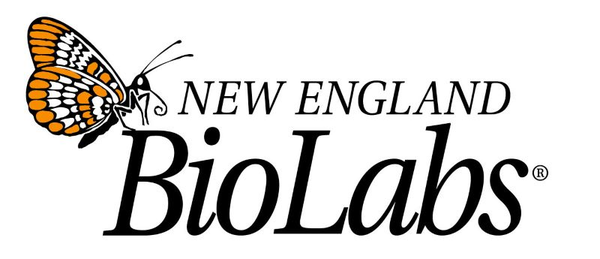 |
| 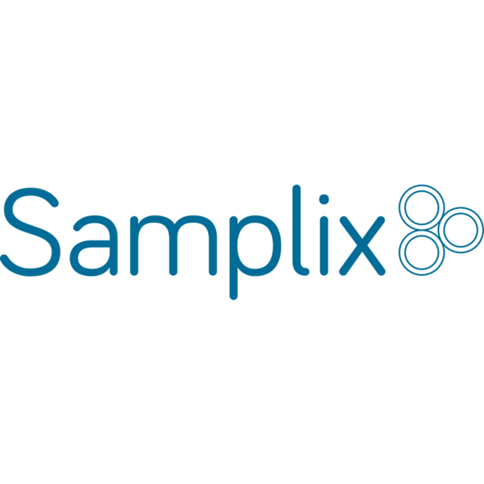 | 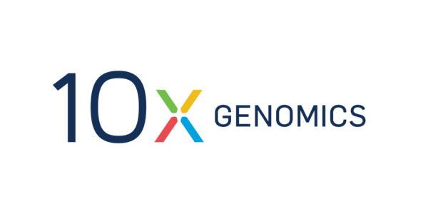 |
| 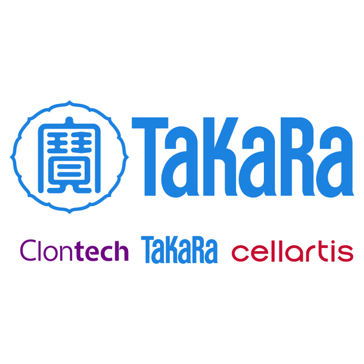 | 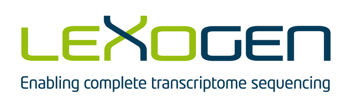 |

### Silver

|   |   |
| ------------- |---------------| 
| 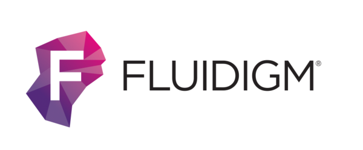 | 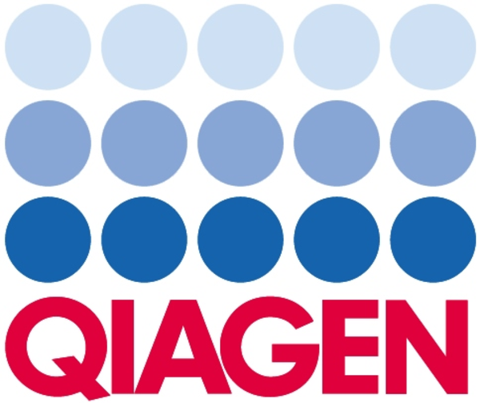 |
| 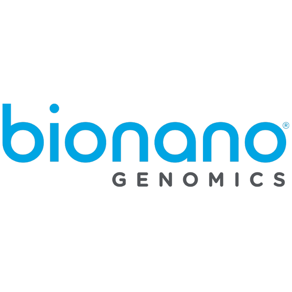 | 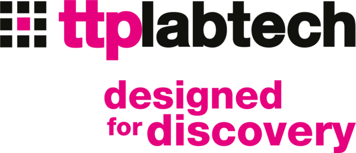 |
| 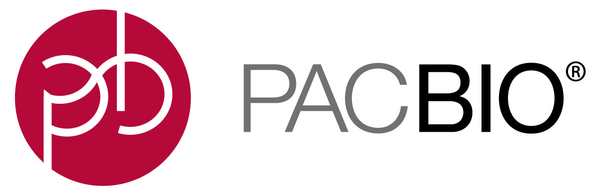 | 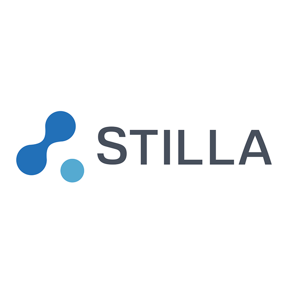 |
| 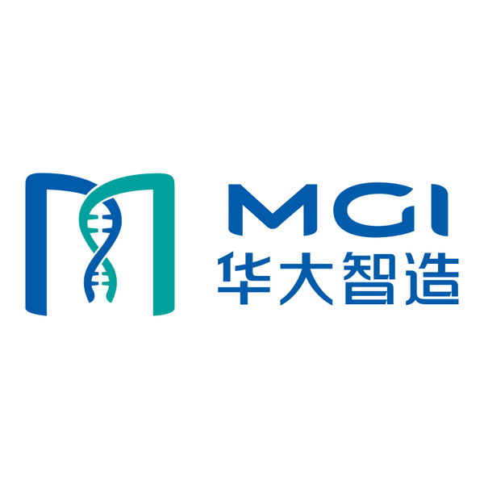 | 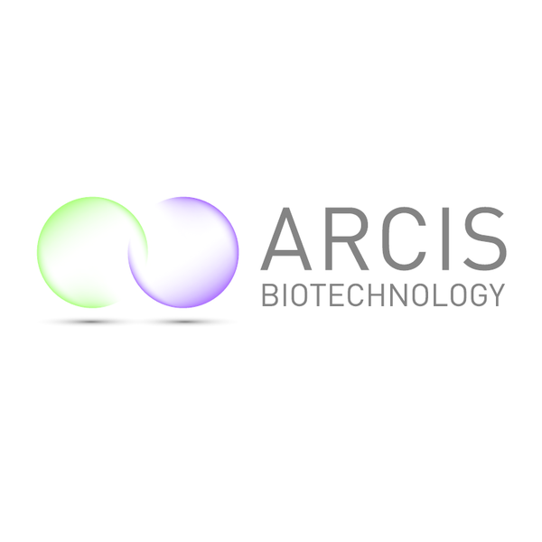 |

### Bronze

|   |   |
| ------------- |---------------| 
| 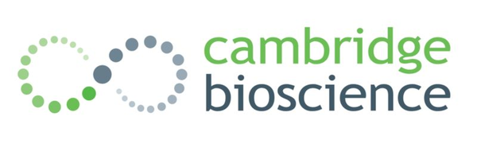 |  |
| 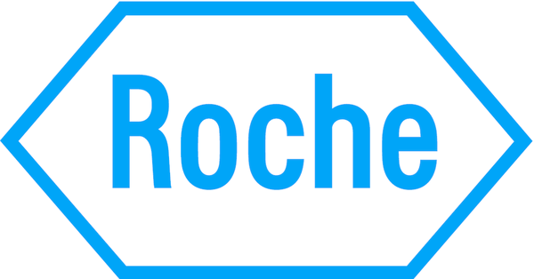 | 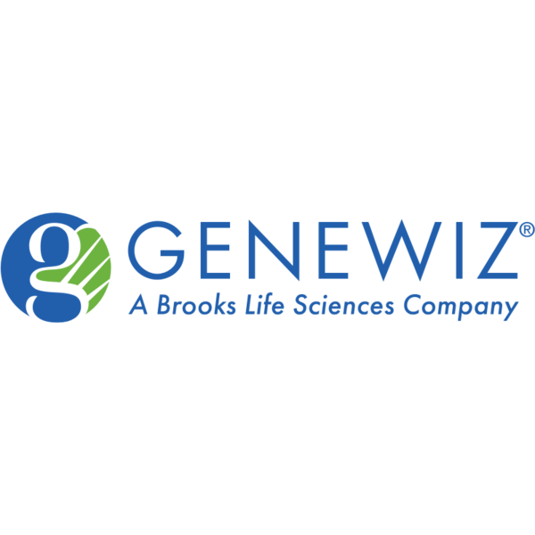 |
| 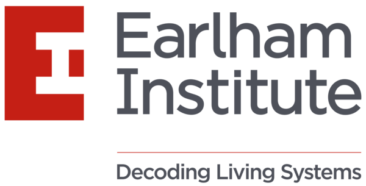 |   |

